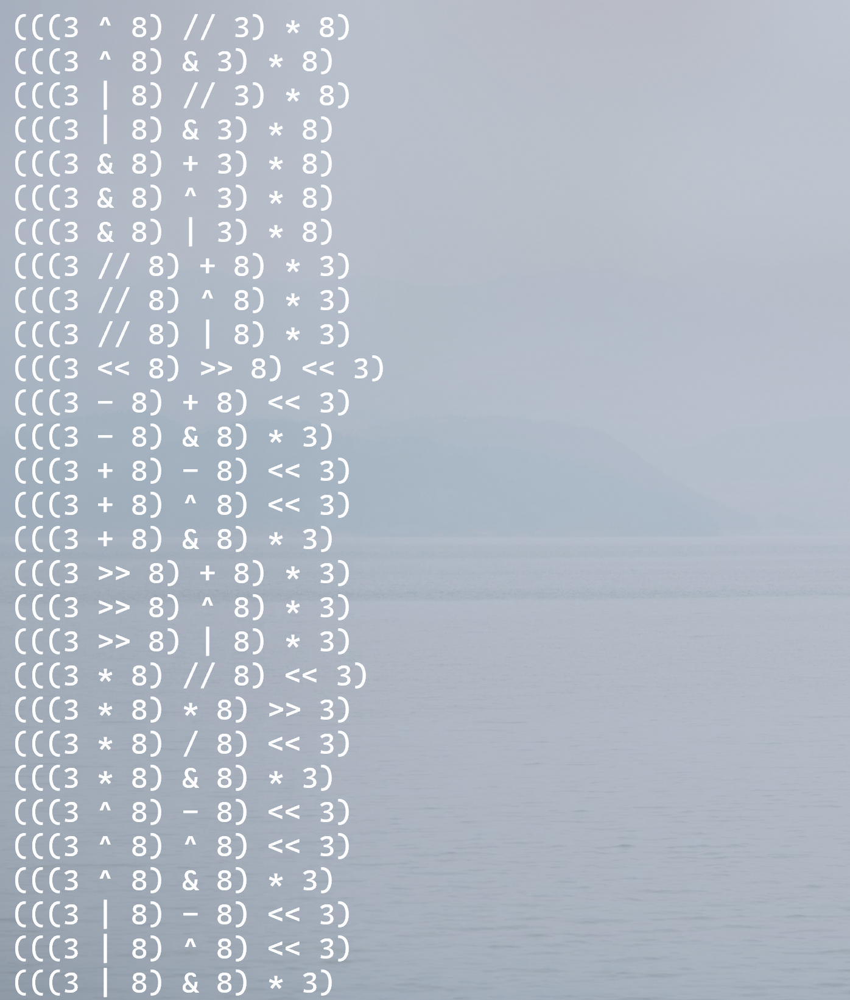

# 24-point-extended

Tired of getting an unsolvable number at 24 points? 

3 3 8 8 😢

That's because the limited rule. Extended 24 point that introduces bitwise and, bitwise or, left shift, exponent and other powerful operators, solve every unsovalable numbers:

(a small subsets of possible solutions)

Embrace the infinity 